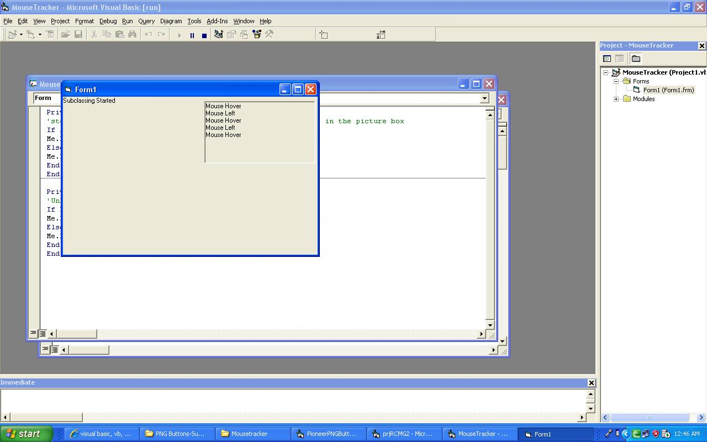



## Mouse Tracker

### Description

This is my first submission on planet source code...

This an example that I wanted to share with everyone, I tried to search various sites to find out

a cool way to track the mouse enter and mouse exit for a control but all the examples that I found

were either non-working or they used timers to accomplish the tracking, some of them used subclassing

but the code was very complex and buggy. So I finally tried to create my own routines and I was able

to find a way out with a very simple subclassing technique. Timers Take a Lot of system resources

and can be very resource consuming if you want to track several Controls.

I have tried to comment everywhere i felt necessary but still if you face any problem you can

e-mail me: pradeep.ansh.sumit@gmail.com,

I have taken Ideas from several subclassing routines and

if you find that some of the code matches your routines please accept my thanks and credits for

Ideas.

Please Do Vote If You Like The Code and Idea

'!!!!!Happy Coding!!!!!
 
### More Info
 

             |
---                |---
**Submitted On**   |2010-08-04 00:44:48
**By**             |[Pioneer Soft](https://github.com/Planet-Source-Code/PSCIndex/blob/master/ByAuthor/pioneer-soft.md)
**Level**          |Intermediate
**User Rating**    |4.7 (14 globes from 3 users)
**Compatibility**  |VB 6\.0
**Category**       |[Windows API Call/ Explanation](https://github.com/Planet-Source-Code/PSCIndex/blob/master/ByCategory/windows-api-call-explanation__1-39.md)
**World**          |[Visual Basic](https://github.com/Planet-Source-Code/PSCIndex/blob/master/ByWorld/visual-basic.md)
**Archive File**   |[Mouse\_Trac218564832010\.zip](https://github.com/Planet-Source-Code/pioneer-soft-mouse-tracker__1-73315/archive/master.zip)

